# Dogfood Report: Deterministic Scene Layout Prototype

| Field | Value |
|-------|-------|
| **Date** | 2026-07-22 |
| **App URL** | http://127.0.0.1:4178/?variant=matrix#layout-prototype |
| **Session** | mdx-layout-qa |
| **Scope** | Wide, narrow, print, no-CSS, dense-capacity, navigation, console, and accessibility-oriented layout verification |

## Summary

| Severity | Count |
|----------|-------|
| Critical | 0 |
| High | 3 |
| Medium | 2 |
| Low | 0 |
| **Total** | **5** |

**Outcome:** 5 found, 5 fixed and reproduced as resolved, 0 open.

## Validation log

- **Wide matrix:** all three rows now allocate 1120px to rich and 380px to each fallback state, with a measured 10px gap between every neighboring cell and no cell-level overflow.
- **Wide rails/article:** source-first figures render without page overflow; article figures retain `FIGCAPTION → PRE → OL → DL`, 27 visible source markers, 18 complete legend entries, no connectors, and no missing/duplicate description references.
- **320px:** rails and article each keep the prototype at `302px clientWidth === 302px scrollWidth`; all 27 markers and 18 legends remain, connectors and legend collisions are zero. Terminal alone scrolls horizontally inside its source (`230px clientWidth / 468px scrollWidth`). Matrix contains its 2880px contact sheet inside a 266px horizontal region while the page body remains `320px / 320px`.
- **Print:** Chrome generated exactly three prototype-only PDF pages. Task, terminal, and status-change each print as complete source + markers + legend with no connector; terminal's final `Cap requests…` line is visible and no internal scrollbar remains.
- **Forced colors:** real Chrome forced-colors mode passed at 1200px and 800px: 27/27 source markers, 18/18 legend items, zero visible connectors.
- **No CSS:** six stylesheets were disabled and zero remained active. Every figure still reads `FIGCAPTION → PRE → OL → DL`; legend counts are 6/8/4 and all canonical source tails remain present.
- **Reference + 1:** task, terminal, and status-change all use `deterministic compact fallback`, have no rail and no connector, keep complete legends (7/9/5), have zero legend collisions, and remain within their 378px cells.
- **Host page:** a fresh Chrome session reports `expect no-errors`; the Showcase CTA is a `DIV`, nested paragraphs are zero, and the raw source panel contains 1806 characters including the scene and setup-link source.
- **Repository:** typecheck, 91 tests, package builds, and production docs build pass.

## Issues

### ISSUE-001: Existing Showcase emits two React render errors

| Field | Value |
|-------|-------|
| **Severity** | medium |
| **Category** | console / content |
| **URL** | http://127.0.0.1:4178/?variant=matrix#layout-prototype |
| **Repro Video** | N/A — visible on load in the captured browser console |

**Description**

On two consecutive loads, React reported invalid nested `
` markup in the Showcase CTA and a function rendered as a child inside the compiled MDX code sample. The layout prototype still mounts, but a clean browser validation cannot pass while the host page emits render errors and one error indicates missing rendered content.

**Repro Steps**

1. Open the matrix prototype URL in a clean Chrome session with console capture enabled.
   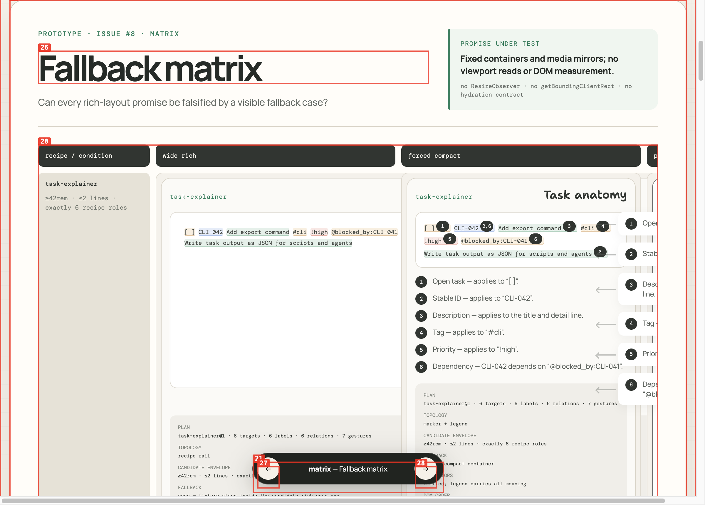
2. Wait for network idle and inspect the captured console.
3. **Observe:** React reports both `p cannot be a descendant of p` and `Functions are not valid as a React child`.

**Resolution**

Changed the explicit CTA wrapper to a `div`, and wrapped the MDX Rollup transform so `?raw` requests remain Vite raw strings. A fresh Chrome session has zero React errors and the source panel is populated.
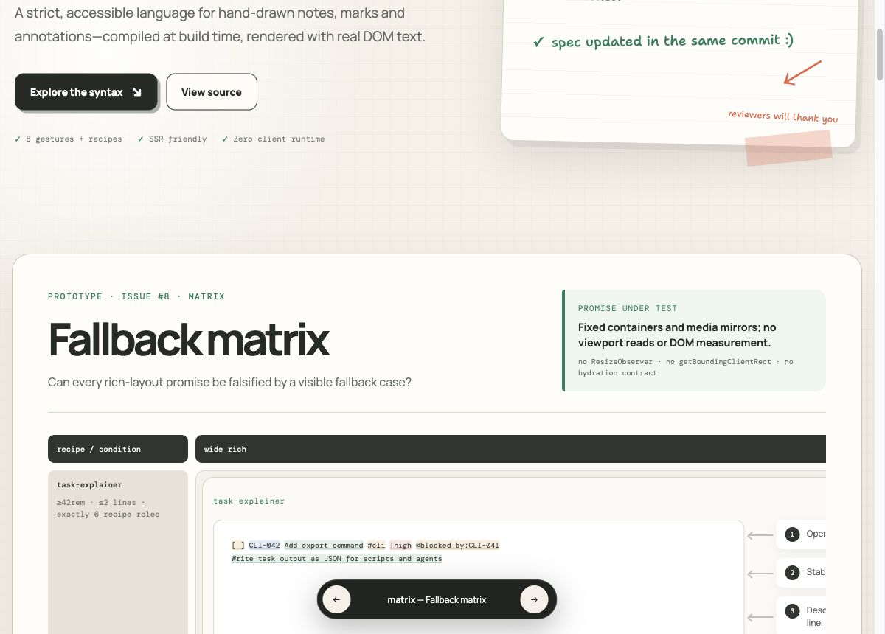

---

### ISSUE-002: Rich rail escapes its matrix track and overlaps later states

| Field | Value |
|-------|-------|
| **Severity** | high |
| **Category** | visual / responsive |
| **URL** | http://127.0.0.1:4178/?variant=matrix#layout-prototype |
| **Repro Video** | N/A — static on load |

**Description**

At a 1600 × 1000 CSS-pixel viewport, the `task-explainer` rich cell is wider than the matrix track allocated to it. Its label rail and connectors extend across the forced-compact cell into the `print / forced colors` column. Later cell titles and legends are consequently clipped and overlapped. Every matrix state must remain inside its own bounded track.

**Repro Steps**

1. Set Chrome to a 1600 × 1000 viewport and open the matrix prototype at its hash.
2. Keep the matrix at horizontal scroll position zero.
3. **Observe:** the rich rail overlaps the forced-compact and neighboring print cells.
   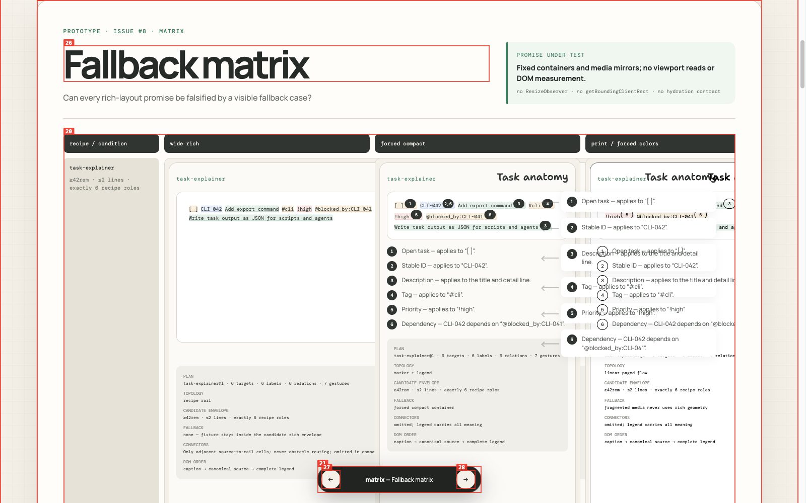

**Resolution**

Allocated a real 1120px rich Grid track and four bounded 380px fallback tracks. Browser measurements now show a 10px gap between every state in all three rows.
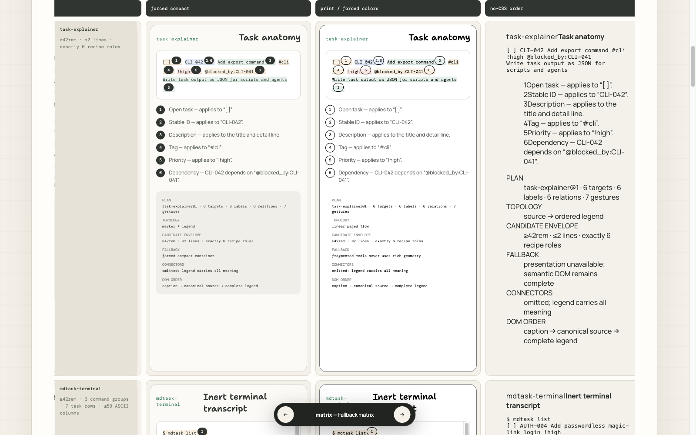

---

### ISSUE-003: Variant navigation loses the Layout lab anchor

| Field | Value |
|-------|-------|
| **Severity** | medium |
| **Category** | functional / ux |
| **URL** | http://127.0.0.1:4178/?variant=rails#layout-prototype |
| **Repro Video** | [issue-003-repro.webm](videos/issue-003-repro.webm) |

**Description**

Switching from a scrolled Recipe rails scene to Reader-first article updates the query and leaves `#layout-prototype` in the URL, but the new document opens at the page top instead of the Layout lab. The user must manually find the prototype again.

**Repro Steps**

1. Open Recipe rails and scroll to the status-change scene.
   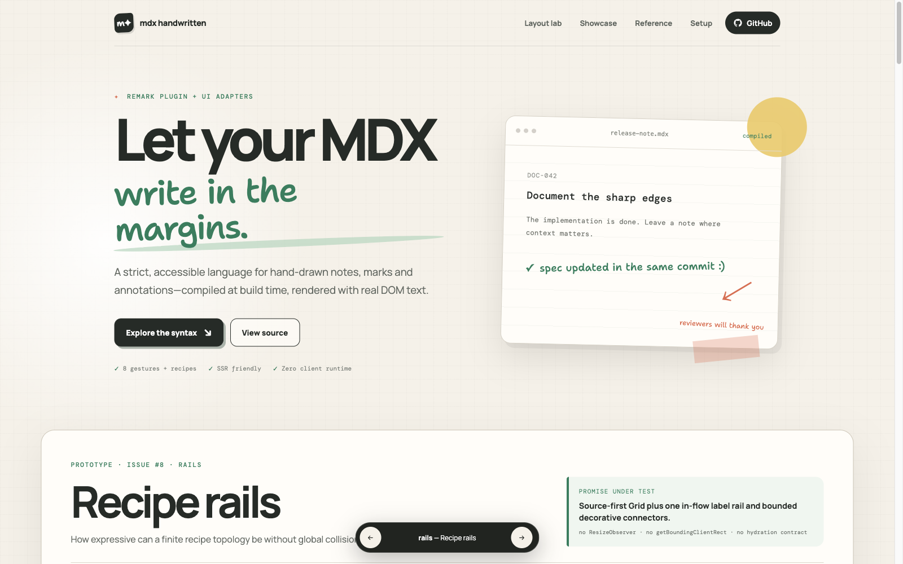
2. Click **Next variant: Reader-first article**.
3. **Observe:** the URL changes to `variant=article#layout-prototype`, while the viewport returns to the site hero and the prototype remains 762 CSS pixels below it.
   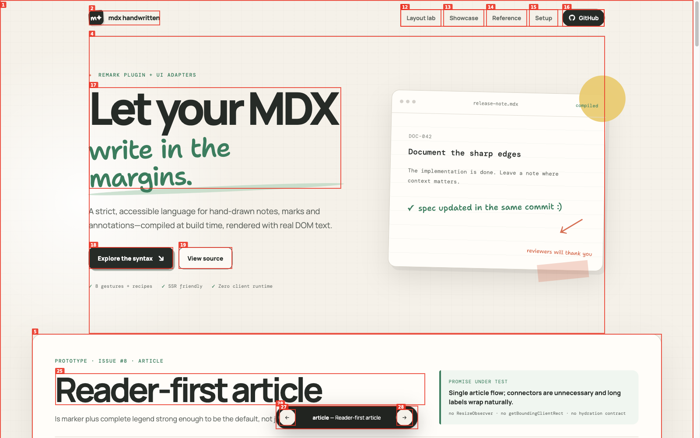

**Resolution**

Variant changes now explicitly scroll the existing Layout lab section to the block start after updating query/hash state. Both button and Arrow-key transitions finish with `top === 0`.
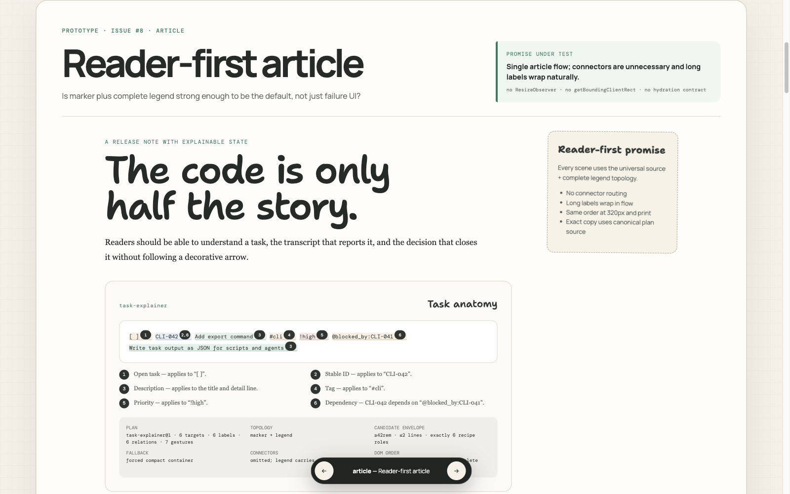

---

### ISSUE-004: Printed terminal source remains scroll-clipped

| Field | Value |
|-------|-------|
| **Severity** | high |
| **Category** | visual / content |
| **URL** | Generated from http://127.0.0.1:4178/?variant=matrix#layout-prototype |
| **Repro Video** | N/A — static in Chrome's generated PDF |

**Description**

Chrome generates the intended three-page prototype-only PDF, and task/status scenes linearize correctly. On page 2, however, the terminal source keeps an internal vertical scrollbar and clips the end of the canonical transcript. Print must expose the complete source in normal flow.

**Repro Steps**

1. Open the matrix prototype and generate a PDF with Chrome's print pipeline.
2. Open page 2 in Chrome PDF Viewer.
3. **Observe:** the terminal source has a vertical scrollbar and its final transcript content is clipped.
   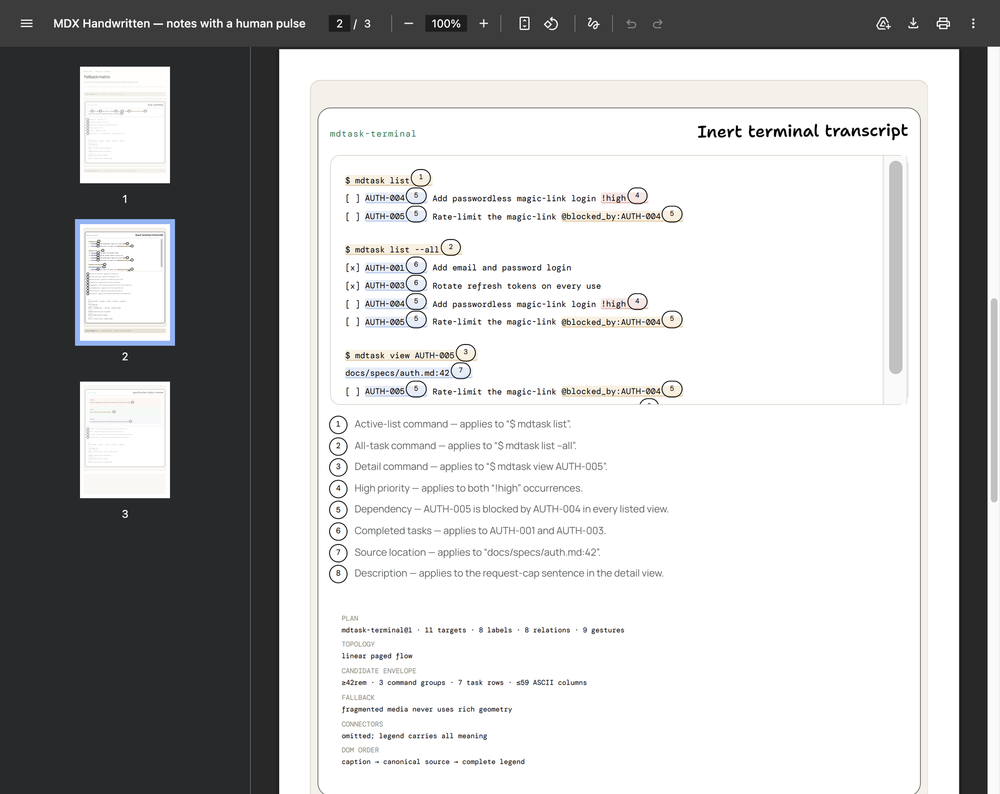

**Resolution**

Print removes source max-height/overflow and allows the terminal transcript to wrap. Chrome's regenerated page 2 contains the full canonical transcript and all eight legend entries without a scrollbar.
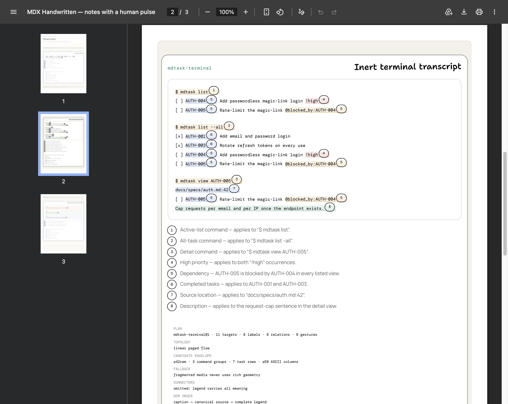

---

### ISSUE-005: Forced-colors fallback drops most source markers

| Field | Value |
|-------|-------|
| **Severity** | high |
| **Category** | accessibility / visual |
| **URL** | http://127.0.0.1:4178/?variant=rails#layout-prototype |
| **Repro Video** | N/A — static in forced-colors mode |

**Description**

With Chrome's real forced-colors mode active, all connectors disappear and all 18 legend entries remain. However, only the three status-change marker pseudo-elements are visible; task and terminal lose every numbered source marker. Their source tokens are outlined, but the reader cannot map legend numbers back to those tokens.

**Repro Steps**

1. Launch Chrome with forced colors and open Recipe rails at a 1200 × 860 viewport.
2. Confirm `matchMedia('(forced-colors: active)').matches` is true.
3. **Observe:** task and terminal have no numbered source markers; only 3 of 27 marker-bearing ranges expose a marker.
   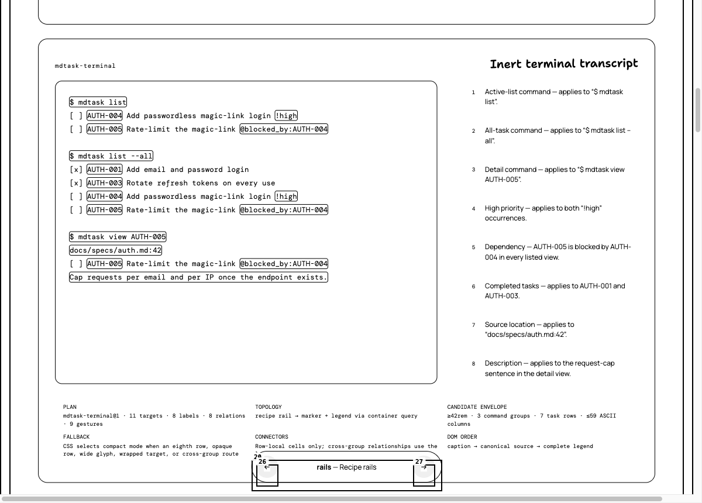

**Resolution**

Forced-colors now restores every rails marker with system colors and a current-color outline. Both tested widths show 27 markers, 18 legend entries, and zero connectors.
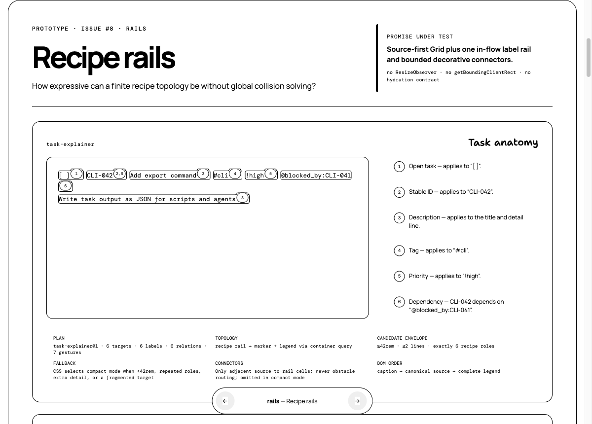
